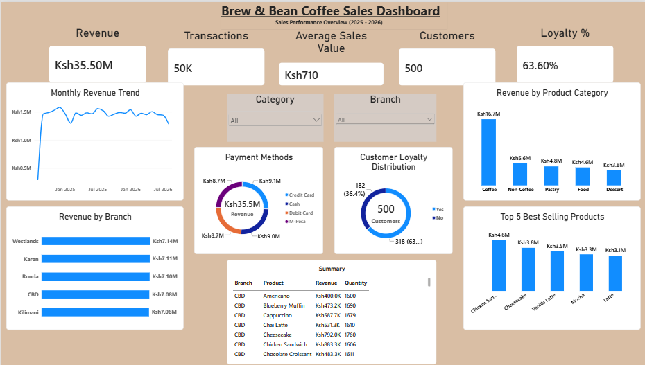
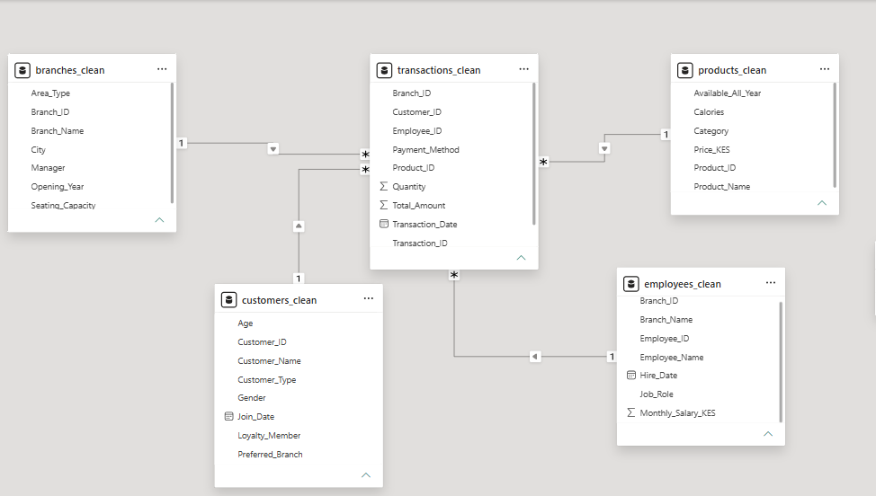

# ☕ Brew & Bean Business Intelligence

## Overview

Brew & Bean is a fictional coffee shop chain operating five branches across Nairobi. Despite steady growth, management lacks visibility into sales trends, customer behaviour, product performance, and branch profitability.

This project demonstrates an end-to-end Business Intelligence workflow using Python, Excel, and Power BI to transform raw transactional data into actionable business insights.

## Objectives

- Analyze sales performance across branches.
- Understand customer purchasing behaviour.
- Identify top-performing and underperforming products.
- Measure branch profitability.
- Build interactive dashboards for business decision-making.

## 🛠️ Tools & Technologies

- **Python**
  - Pandas
  - NumPy
  - Matplotlib
- **Jupyter Notebook**
- **Microsoft Power BI**
- **DAX (Data Analysis Expressions)**
- **Git & GitHub**

## 📂 Dataset

The project uses transactional sales data for Brew & Bean Coffee consisting of approximately **50,000 transactions** across multiple related tables.

The dataset includes:

- Transactions
- Customers
- Products
- Branches
- Employees

## 🔄 Project Workflow

```text
Raw Data
    │
    ▼
Data Cleaning (Python)
    │
    ▼
Exploratory Data Analysis
    │
    ▼
Cleaned Datasets
    │
    ▼
Power BI Data Model
    │
    ▼
DAX Measures
    │
    ▼
Interactive Dashboard
    │
    ▼
Business Insights
```
## 📊 Dashboard Features

The dashboard provides interactive insights into:

- 💰 Total Revenue
- 🛒 Total Transactions
- 👥 Total Customers
- 📈 Average Sales Value
- ⭐ Customer Loyalty Percentage
- 🏪 Revenue by Branch
- ☕ Revenue by Product Category
- 🥐 Top Selling Products
- 💳 Payment Method Distribution
- 📅 Monthly Revenue Trend

## 📷 Dashboard Preview



## 🗂️ Data Model




## 🔍 Key Insights

- Revenue exceeded **KES 35 million** during the reporting period.
- Coffee products generated the highest share of total revenue.
- Branch performance remained relatively balanced across all locations.
- Over **60%** of customers were enrolled in the loyalty programme.
- Customers used Cash, Credit Card, Debit Card, and M-Pesa in relatively equal proportions.

## 💡 Business Recommendations

- Continue investing in high-performing coffee products.
- Expand the customer loyalty programme.
- Monitor branch performance regularly to identify improvement opportunities.
- Use the dashboard to support data-driven business decisions.

## 📁 Repository Structure

```text
Project-01/
│
├── data/
│   ├── raw/
│   └── processed/
│
├── notebooks/
│   └── Brew_Bean_EDA.ipynb
│
├── powerbi/
│   └── Brew_Bean_Dashboard.pbix
│
├── reports/
│   └── Brew_Bean_Coffee_Sales_Analysis_Report.pdf
│
├── images/
│   ├── dashboard.png
│   └── data_model.png
│
├── requirements.txt
├── README.md
└── .gitignore
```

## 🚀 Getting Started

### Clone the repository

```bash
git clone https://github.com/yourusername/Project-01.git
```

### Navigate to the project folder

```bash
cd Project-01
```

### Create and activate a virtual environment

**Windows (Git Bash)**

```bash
python -m venv .venv
source .venv/Scripts/activate
```

### Install dependencies

```bash
pip install -r requirements.txt
```

### Launch Jupyter Notebook

```bash
jupyter notebook
```

Open the notebook in the `notebooks` folder to explore the data preparation and analysis process.

## 📄 Project Report

A detailed report describing the project methodology, dashboard design, business insights, and recommendations is available in the `reports` folder.

## 👤 Author

**Ms. Whitney Gituara**

Aspiring Data Analyst | Business Intelligence Enthusiast

## ⭐ Acknowledgements

This project was developed as part of my personal data analytics portfolio to demonstrate practical skills in Python, data analysis, and Power BI dashboard development.

